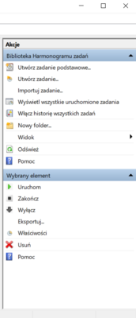
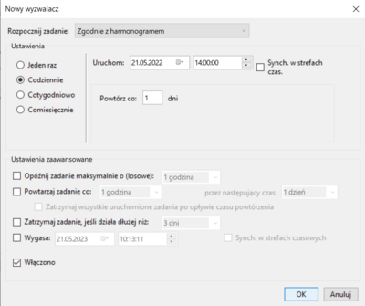

# WindowsBackup

## Konfiguracja skryptu

Należy dokonać edycji czwartej i jedenastej linijki pliku _WindowsBackup.bat_, na przykład poprzez notatnik.  
Konieczne jest ręczne wpisanie dwóch ścieżek w systemie. Pierwszej, z której ma być utworzona kopia zapasowa, oraz drugiej, do której pliki mają zostać skopiowane.

## Instrukcja jak wykonywać cyklicznie i automatycznie kopię zapasową.

Na komputerze z systemem Windows należy uruchomić aplikację **Harmonogram zadań**.

Z bocznego menu wybrać opcję **"Utwórz zadanie..."**.

Po wpisaniu nazwy zadania, należy przejść do zakładki "**Wyzwalacze**".

Kliknąć przycisk z napisem "**Nowy...**" w lewym bocznym rogu.

Pojawi się okno ustawień wyzwalacza. Na poniższym, przykładowym zdjęciu wyzwalacz został skonfigurowany, aby uruchamiać zadanie codziennie o godzinie 14:00.  
Po zakończeniu należy nacisnąć przycisk "**OK**" oraz przejść do zakładki "**Akcje**".

W zakładce "**Akcje**" należy kliknąć przycisk "**Nowa...**".  
W polu "**Program/skrypt**" konieczne jest wyszukanie lub podanie ścieżki do pliku _WindowsBackup.bat_ a następnie zatwierdzenie przyskiem "**OK**".

Na koniec należy zatwierdzić proces tworzenia zadania przyciskiem "**OK**".  
To tyle!
